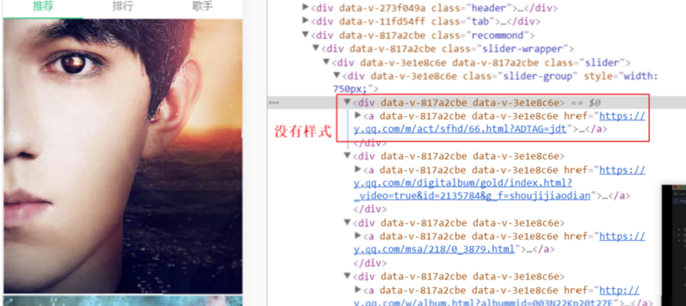

# QQ-music日志
## recommond
### 拉取数据
```
npm install jsonp --save
```
[jsonp地址](https://github.com/webmodules/jsonp)
> 对jsop插件进行一次封装,来获取数据,主要是处理url和传入的参数,并且指定callback

### 图片挂载问题
> 设置了图片的样式和slider的宽度以后 图片的大小没有变化还是很大  

- 在slider组件中,我是在mounted这个钩子函数中执行setSliderWidth这个函数设置轮播总长度和给slider-item添加class
- 而在recommond中我获取数据是在created这个初始化完成的钩子中获取,在created时候获取是为了保证后面挂载的正常进行,但是其实获取数据的过程是需要时间的
- 也就是说在我进行mounted这一步的时候,我的数据可能还没get回来,slider里面并没有元素,即使数据获取回来后,mouted已经结束,所以样式未添加上
- 解决 在slider标签增加 v-if="recommondData.length" 数据请求成功后再进行挂载


如图:


## 歌单Scroll组件的滚动问题

这个问题真的是无语

- 第一使用浏览器原本的scroll来滚动,可以滚,但是体验不好
- 第二用了vue-scroll组件,滚动完美,但是有一个问题,就是我里面放入了轮播图,当我再去滑动轮播图的时候,手指完全水平,不会有问题,如果在滑动也就是touchmove过程中y轴move的距离稍微大一点点就会导致页面向上滑动,也就是我只是单纯想滑动轮播图,会造成页面轮播图一起动,体验同样不好....看vue-scroll文档没找到调试的api
- 还是用了better-scroll,自己写了scroll组件,然后不能滚动,找问题找了一个多小时,样式,数据绑定都检查过,没问题,渲染正常,但就是不滚动,后来发现,scroll组件的slot用来将recommend渲染的数据插入,从而撑开scroller 来进行滚动,然后我在获取数据后输出数据,scrollInit后打印组件状态,如下图:


可以看到,scrollInit的时机是先于数据获取的,所以scroll没有被数据撑开,就不能滚动,第三行是我在scroll标签上绑了dissList,并watch他的状态,如果变化就调用scroll的refresh方法,然后就能撑开并滚动了


